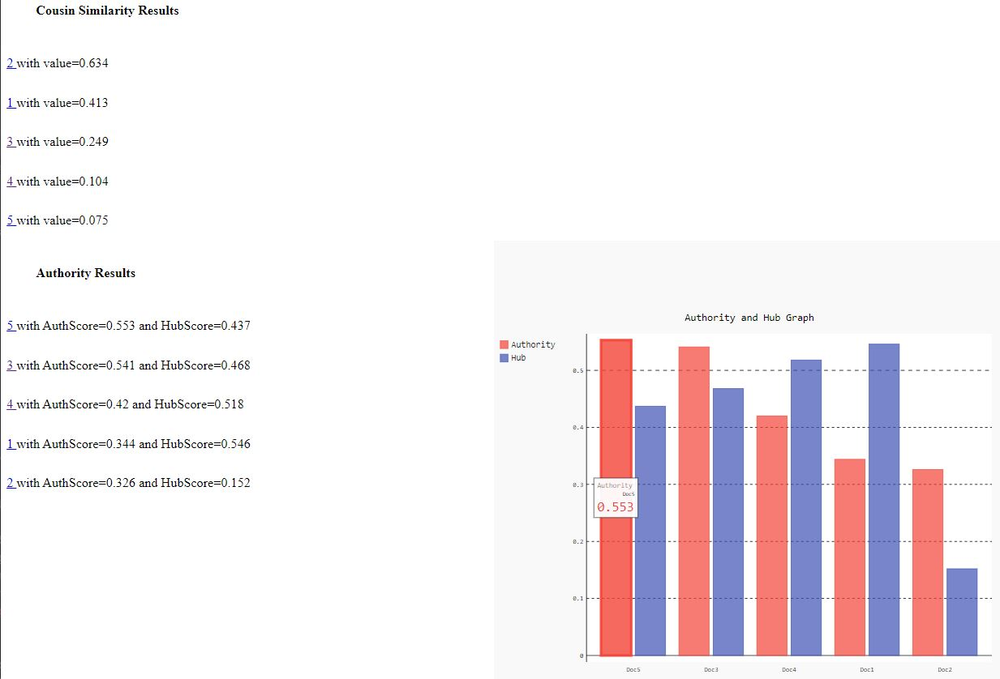

# mini-search-engine
## Introduction
- Implementation of a text based information retrieval system
- The searching module  built according to the Vector Space model and authority and hub score .
- the text files in resources directory simulates the websites where the name of the file represents the link of it
- each text file has text data (chars A B C D E .. ) and numbers , numbers are hyperlinks to another files for authority and hub score for each site or file
## usage
- Homepage (enter the query (A B ... etc) and press search)

- query result html displaying the result of the query 
    - files sorted according to cosine similarity and sorted according to authority and hub score of the files(websites) 
    
    - data in files that outputs the previous result
      - 1.txt \[A 4 5 4 5 1 1 C 3 B E]
      - 2.txt \[A B 4 2 E E D]
      - 3.txt \[B 4 2 5 E 4 B C E B 4 B]
      - 4.txt \[5 A 5 D A 3 D 1]
      - 5.txt \[1 A C 5 3 D 2]
